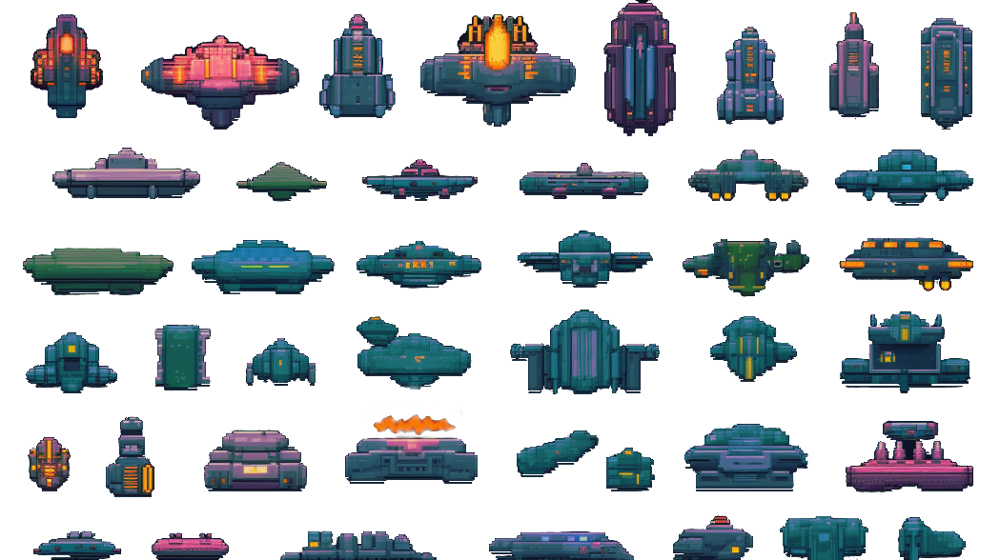
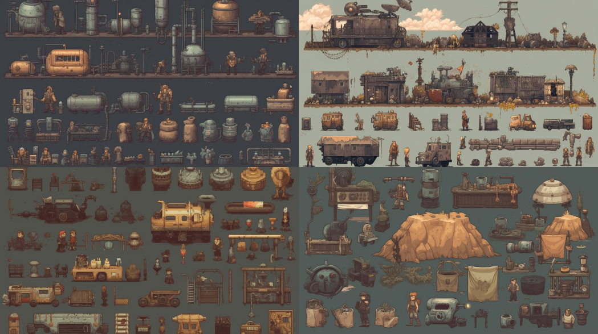
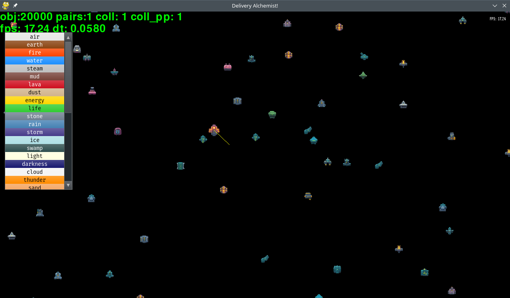
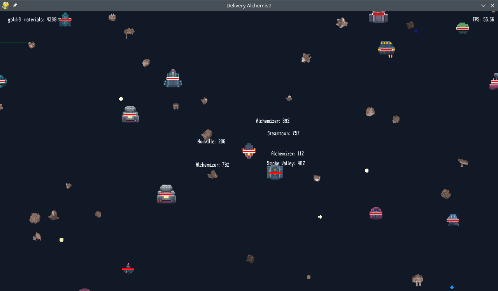

# LD53 Delivery - Delivery Alchemist!


Get ready to embark on a thrilling journey through the cosmos in Delivery Alchemist, a unique game that masterfully combines space exploration, alchemy puzzles, and an element of discovery. As the universe's most skilled Delivery Alchemist, you've been entrusted with a vital mission: to explore distant planets, unlock hidden secrets, and deliver rare and valuable elements to the many civilizations that inhabit the cosmos.

Utilize your alchemical prowess to combine elements and create new materials while completing quests for diverse communities you encounter on your interstellar travels. With over 60 elements to discover and a multitude of quests to accomplish, you'll find yourself lost in a captivating, vibrant universe teeming with surprises.

Key Features:

* Innovative gameplay: Seamlessly blend space exploration, alchemy puzzles, and discovery as you traverse the cosmos.
* Expansive universe: Venture through an array of Levels, each with its own unique locations, inhabitants, and challenges.
* Develop your abilities: Unlock new skills and knowledge as you progress through the game, enhancing your alchemical expertise and delivery prowess.

Embark on a cosmic adventure like no other and become the Delivery Alchemist the universe desperately needs. Are you ready to accept the challenge and chart your course through the stars?


# Postmortem Jam Version May 1st 2023

I didn't finish this game in time for the compo and had trouble getting pybag to work, because of pygame_gui. So it will be a Jam or Extra Game.

I wrote this game as an experiment using AI in the form of MidJourney v5 and ChatGPT4.
I used pygame + the pygame_gui library and used no music or sound.

I will try to explain what I did what worked well and what didn't and give an overall conclusion, not just on AI but on the whole experience.


## what worked well?

* **ChatGPT**: works like magic, from coming up with ideas for mechanics and gameplay , to creating the levels and alchemy content, to quite intricate algorithms and clever functions I couldn't have done as much in such a small time without it.
* **Python**: python + pygame really don't get in the way much
* **Preparation** I spent the Friday before the Jam preparing my setup and writing a small framework. I'm in Germany, so the Jam starts at 3 am on Saturday
* **Spritesheet workflow**: I created spritesheets straight in MidJourney and used a tool called [sprite-cow](https://github.com/jakearchibald/sprite-cow) to generate a spritesheet, which allowed for a super fast art creation process, more on that later.
* **Random Generation** Using Randomness as usual works well to create a variety of content that seems interesting. Pythons randon library is excellent. Nothing new here!

## What didn't go so well?
* **pygbag** I planned to release the game using pygbag, which allows for pygame games to run in the browser, I didn't test the pygame_gui lib though, which somehow doesn't work.
* **Midjourney prompting** While Midjourney creates amazing beautiful pictures it is sometimes impossible to generate exactly what you want. In this case I wanted to have a top down post apocalyptic steampunk world, but ended up having to use the space sprites, as they were more usable.
* **Sound** Didn't do anything here I created some music using [abundant-music](), which haven't made it into the game as of yet. I might spend an hour or two on my windows computer to get sounds for everything and also music, but so far no sound.
* **collision detection** As usual rolling your own collision detectiona and resolution whithin a weekend doesn't work so well, I have tried and failed before, so no surprises here. I abstained from using box2 or pymunk because I wanted to use pygbag to publish and they didn't work. but in retrospect, that could have saved a lot of time and also made the game probly more fun.
* **fun** As usual fun is the most elusive variable to chase after and I understand now that it can take quite some time to tweak a game to the point  where it is fun, so no surprises here.


## ChatGPT: A Helpful Assistant

### How ChatGPT Helped

ChatGPT was a game-changer in the development process. It helped with:

1. Generating ideas for mechanics and gameplay
2. Creating levels and alchemy content
3. Developing intricate algorithms and clever functions

With ChatGPT, the development process was faster and more efficient than ever before.

I was able to ask for different game ideas and mechanics. I combined the concepts using simple language and then went into generating systems and datastructure code for python all in one seemless session.

I created a broadphase optimization for collision detection from scratch which uses a list sorted by the objects x value and uses bisect to find object indices for rendering and collisions and also for removing and inserting them when their position changes during updates. All while keeping the references to important game objects like the player.
all in all the code base it at 2673 Lines of Code after the weekend:

```sh
broad_phase_test.py: 145
test_map_gen.py: 14
test_alchemy.py: 8
game/quests.py: 455
game/map_gen.py: 41
game/windows.py: 250
game/alchemy.py: 253
game/image_manager.py: 62
game/game_objects.py: 347
game/physics.py: 279
game/__init__.py: 9
game/colors.py: 13
game/loop.py: 272
create_element_theme.py: 58
main.py: 421
count_lines.py: 32
cleanup_spritesheets.py: 14

2673 lines in 17 files
```

Of which at least these are almost entirely chatgpt:

```sh
broad_phase_test.py: 145
test_map_gen.py: 14
test_alchemy.py: 8
game/quests.py: 455
game/map_gen.py: 41
game/alchemy.py: 253
game/image_manager.py: 62
game/physics.py: 279
cleanup_spritesheets.py: 14

1271 lines in 9 files
```

So it is fair to say that about half of the code was written by ChatGPT, which sounds great for a productivity junkie like me.

Some cool things I did with the help of ChatGPT:

* Ask to write a function that times an algorithm to be able to predict how many objects I can use.
* Ask to write a function that uses timeit to time different versions of an algorithm to choose the faster variant.
* Developing a working broadphase algorithm from scratch.
* Working out the alchemy system against the quest system, by letting it write code that checks what materials are needed for each quest. And then compare sets and tell it to fix either the alchemy system or the quests based on missing and superflous materials. Working out a system like that would take me a lot longer by myself.
* Writing a location generator that places cities across the map within a minimum and maximum radius
* Coming up with matching colors for each material in the game staright as a python dict


## Spritesheet Workflow: Fast and Efficient

### Using MidJourney and sprite-cow for Spritesheets

MidJourney was used to create spritesheets, which were then processed with a tool called [sprite-cow](https://github.com/jakearchibald/sprite-cow). This resulted in:
these spritesheets:
### Locations
**prompt**: `icons ,checkpoints, sprites for SNES space game, atlas, spritesheet, spriteatlas pixelart SNES, --ar 16:9`

### Ships
**prompt**: `spaceship and weapon systems, sprites for SNES game, atlas, spritesheet, spriteatlas pixelart SNES, --ar 16:9`


## What didnt work:
In my original visionI tried to do a more steampunk, post apocalyptic topdown scenario with these prompts:
**prompt**: `top down post apocalyptic steampunk elements and character sprites, sprites for SNES game, atlas, spritesheet, spriteatlas pixelart SNES, empty background`

**prompt**: `top down topdown::5 post apocalyptic steampunk elements and character sprites, sprites::3 for SNES game, atlas, spritesheet, spriteatlas pixelart SNES, empty background`


And a bunch more I tried:
```
top-down::5 perspective elements and character sprites, apocalyptic alchemy, sprites for SNES game, atlas, spritesheet, spriteatlas pixelart SNES, empty background

top-down::5 perspective elements and character sprites, steampunk, post apocalyptic, apocalyptic alchemy, sprites for SNES game, atlas, spritesheet::5, spriteatlas pixelart SNES, empty background

top-down::5 hotline miami style topdown:5 perspective elements and character sprites, steampunk, post apocalyptic, apocalyptic alchemy, sprites for SNES game, atlas, spritesheet::5, spriteatlas pixelart SNES, empty background

top down 2d game, pixel art, style of hotline miami, top down shooter, post apocalyptic, steampunk, spritesheet:5, sprites:5 (SNES, Game Boy Color) 1991

top down 2d game, pixel art, style of GTA 1, topdown::% shooter, spritesheet:5, sprite sheet, sprites:5 (SNES, Game Boy Color) 1995
```

After which I gave up and went back to the space theme as that gave me great spritesheets to work with.


### Sprite Cow mod
I modified [sprite-cow]() to no only give me one rectangle when selecting a sprite from the sheet, but instead collect all clicks and write them into a json array which I then copied to my file. Again ChatGPT proved useful here to help me write a sprite manager from the json format I gave to it.


Not perfect but it worked well in this case.
Here is [my fork of sprite-cow](https://github.com/jomoho-games/sprite-cow)

## Progress screenshots:

### Day 1:

First day was probably most productive. I started to develop the concept at night and then started to work in late morning.

#### Saturday 29-04-23 13:41

 Working broadphase and pixel perfect collision detection with 20k objects


#### Saturday 29-04-23 15:53

Element colors are generated and ships are loaded from the spritesheet.


#### Saturday 29-04-23 17:09

Not much visual progress, but ship steering works.



#### Saturday 29-04-23 22:02

Ships are behaving by themselves, steering works, and cities are being generated and there is an inidcator where they are.


### Day 2

Day two was a bit slower, I went to get a workout though and started to work a bit later in the afternoon.

#### Sunday 30-04-23 03:03

Technically day 2, experientially day 1, creating menus and different screens tha lead through the game


#### Sunday 30-04-23 18:34

Interacting with alchemizers and cities, also upscaled the city sprites using an online upscaling tool.
Also ships have health bars and bumping into other ships slowly destroys your ship.


### Day 3 Technically

collecting elements was a bit tricky as they had to live in a different layer for performance reason, so I needed to introduce a "ghost" object that follows the player in the main layer and interacts the elements for collecting them



ChatGPT Generated intro text

quests get highlighted in green once they can be fulfilled, still need to be removed once they are fullfilled


